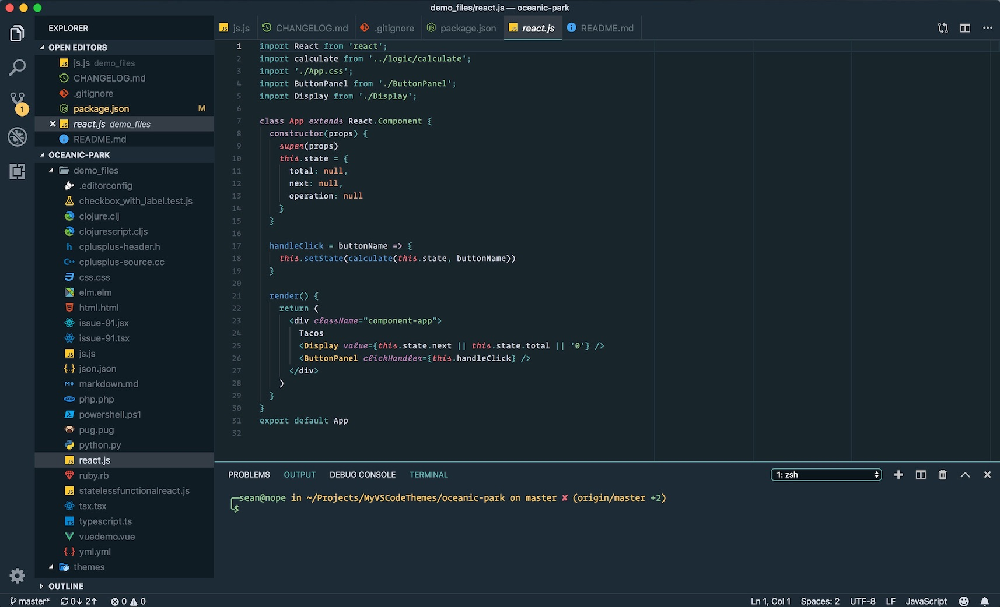

# Dark Ocean Park

An oceanic-inspired dark theme for VS Code, Cursor, and Zed editors.

## Features

- Ocean-inspired color palette with calming blues and aquamarine tones
- Dark theme optimized for long coding sessions
- Wide language support (JavaScript, TypeScript, Python, React, and more)

## Installation

### VS Code

1. Open Extensions (Ctrl+Shift+X)
2. Search for "Oceanic Park"
3. Click Install

### Cursor

Download the VSIX and install manually:

1. Download: https://marketplace.visualstudio.com/_apis/public/gallery/publishers/Parklife/vsextensions/oceanic-park/latest/vspackage
2. Press `Cmd+Shift+P` (Mac) or `Ctrl+Shift+P` (Windows/Linux)
3. Type `Extensions: Install from VSIX...`
4. Select the downloaded `.vsix` file

### Zed

Copy `zed/dark-ocean-park.json` to your Zed themes directory.
Mac: ~/.config/zed/themes
Linux: ~/.config/zed/themes
Windows: %APPDATA%\zed\themes

#### Zed themes
[Dark Ocean Park](https://zed-themes.com/themes/ldw3jOWS7edS-gifHtZg9?name=Dark%20Ocean%20Park)

## Color Palette

| Color | Hex |
|-------|-----|
| Background | `#17242b` |
| Blue | `#61afef` |
| Cyan | `#56b6c2` |
| Purple | `#c678dd` |
| Orange | `#d19a66` |
| Red | `#e06c75` |
| Yellow | `#e5c07b` |

## Contributing

Pull requests are welcome.
